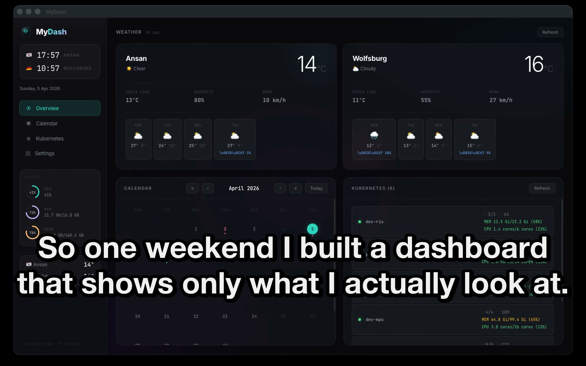
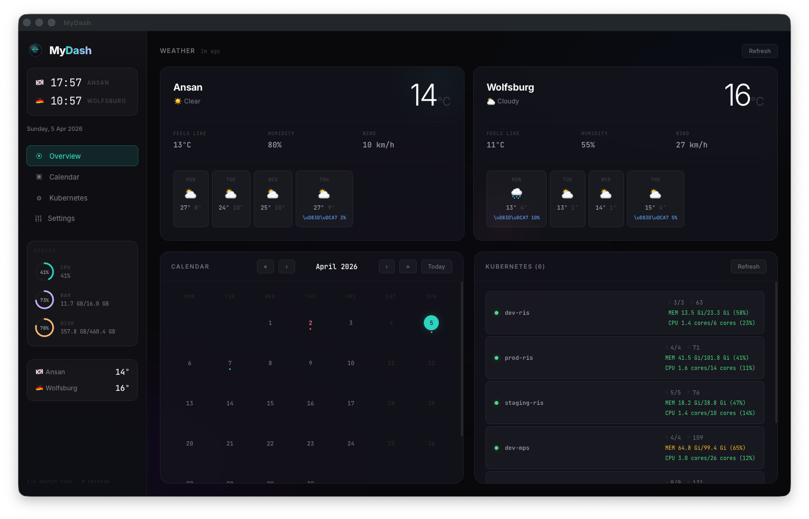
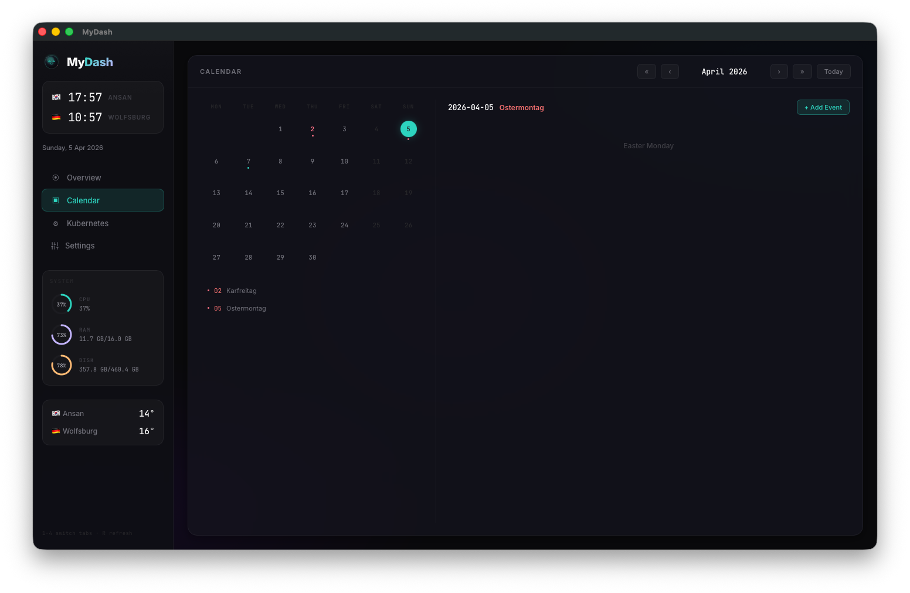
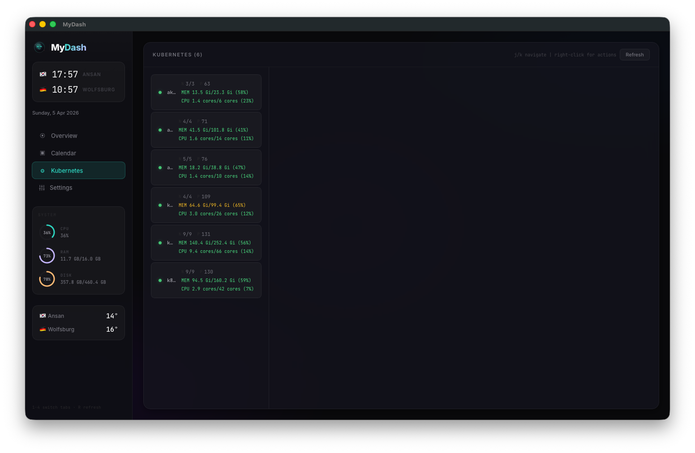
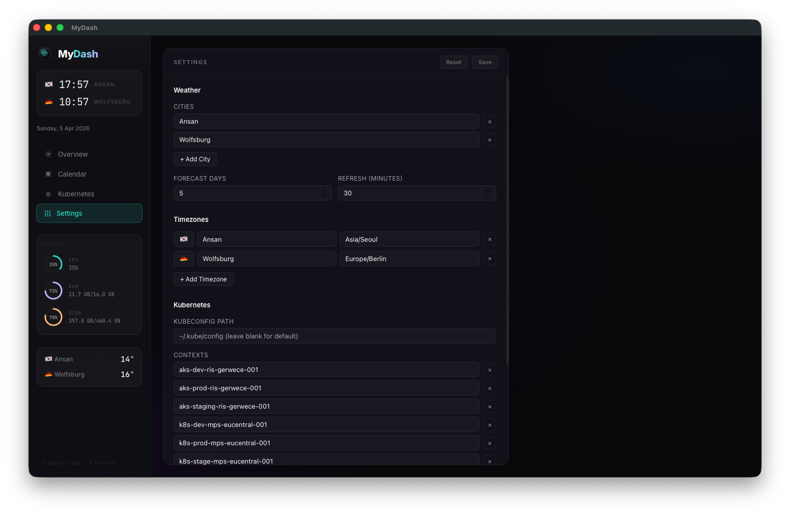

# MyDash

A desktop dashboard I built for myself to keep tabs on everything that matters during my workday -- Kubernetes clusters, weather, calendar, and system resources, all in one window.

I got tired of switching between Lens, browser tabs, and Activity Monitor, so I put together something that shows me exactly what I need at a glance.

[](docs/demo.mp4)



## What it does

- **Weather** -- Current conditions and 5-day forecast for the cities I care about (configurable). Uses Open-Meteo, no API key needed.
- **Calendar** -- Local event management with a clean month grid, holiday highlights (German public holidays / Niedersachsen), and day-detail view.
- **Kubernetes** -- Multi-cluster status overview with drill-down into pods, deployments, services, nodes, and events. Right-click context menus for common operations (restart, scale, cordon, delete). Log viewer built in. Production cluster safeguards with typed confirmation.
- **System Monitor** -- CPU, RAM, and disk usage gauges. Click any gauge to see top processes and kill them if needed.
- **Settings** -- Everything is configurable: cities, timezones, K8s contexts, kubeconfig path, refresh intervals. Settings persist across restarts.



## Tech stack

**Backend:** Go with [Wails v2](https://wails.io) for the desktop shell. Talks to Kubernetes via client-go, weather via Open-Meteo, system stats via macOS native commands.

**Frontend:** React 18, TypeScript, Vite. Custom hooks for data fetching with automatic polling, error states, and loading skeletons. No UI framework -- just well-organized CSS with a dark theme.

**Testing:** Vitest for unit tests (holiday computation, weather logic), Playwright config for E2E.



## Architecture

```
mydash/
  app.go              # Wails bindings -- exposes Go functions to the frontend
  main.go             # Wails app entry point
  internal/
    calendar/         # Google Calendar integration (OAuth)
    config/           # JSON config system (~/.config/mydash/config.json)
    holidays/         # German public holiday computation
    k8s/              # Kubernetes operations (multi-cluster, metrics)
    localcal/         # Local event storage (JSON file)
    sysmon/           # System stats (macOS, via top/vm_stat/syscall)
    weather/          # Open-Meteo weather API client
  frontend/
    src/
      types/          # Shared TypeScript interfaces
      hooks/          # Data fetching hooks (useWeather, useK8s, useSystemStats, useLocalCalendar)
      components/
        shared/       # ErrorBanner, ConfirmModal, Toast, LoadingSkeleton
        k8s/          # K8sClusterList, K8sResourceTable, K8sLogViewer, K8sContextMenu, K8sActionModals
        calendar/     # CalendarGrid, DayDetail, AddEventModal, holidays
```



## Running it

You need Go 1.25+ and Node.js 18+. [Install Wails](https://wails.io/docs/gettingstarted/installation) first.

```bash
# Development (hot reload for frontend)
wails dev

# Build the app
wails build
```

The built app lands in `build/bin/mydash.app` (macOS).

## Keyboard shortcuts

| Key | Action |
|-----|--------|
| `1` `2` `3` `4` | Switch tabs (Overview, Calendar, Kubernetes, Settings) |
| `R` | Refresh all data |
| `j` / `k` | Navigate cluster list (Kubernetes tab) |
| `Esc` | Close log viewer / deselect cluster |

## Config

Settings are stored in `~/.config/mydash/config.json`. You can edit them through the Settings tab or modify the file directly. On first launch, defaults are created automatically.

## Notes

- System monitor uses macOS-specific commands (`top`, `vm_stat`, `sysctl`). Won't work on Windows/Linux without changes.
- Google Calendar integration requires OAuth credentials. Local calendar works out of the box.
- K8s features need a valid kubeconfig. The app reads from `~/.kube/config` by default.
- Destructive K8s operations on production clusters (names containing "prod") require you to type the resource name to confirm.

## License

MIT
